## GIT

### 版本控制

* 面对版本迭代，需要有版本控制管理器。
* 版本控制管理器实现：
  * 跨区域多人协同开发
  * 追踪和记载一个或者多个文件的离职记录
  * 组织和保护源代码
  * 统计工作量
  * 并行开发，提高工作效率
* 主流版本管理器
  * Git
  * SVN
  * CVS
  * VSS
  * TFS
  * Visual Studio Online

#### 版本控制分类

##### 1.本地版本控制

* 记录每次文件的更新，对每个版本做一个快照，适合个人用。

##### 2.集中版本控制

* 所有版本数据保存在服务器上，协同开发者从服务器同步更新或上传自己的修改。
  * 多个人提交代码，如果发生了冲突，需要选择一个上传。
  * 不联网用户看不到历史版本。
  * 必须要定时备份服务器
  * 代表SVN

##### 3.分布式版本控制系统

* 每个人都拥有全部代码（可能有安全隐患）。
* 本地就可以看到历史版本。
* 不会因为服务器损害或者网络问题，造成不能工作的情况。
* GIT是最先进的分布式版本控制系统。

##### 区别

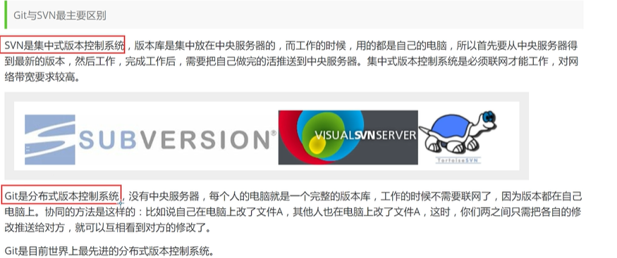

### GIT历史

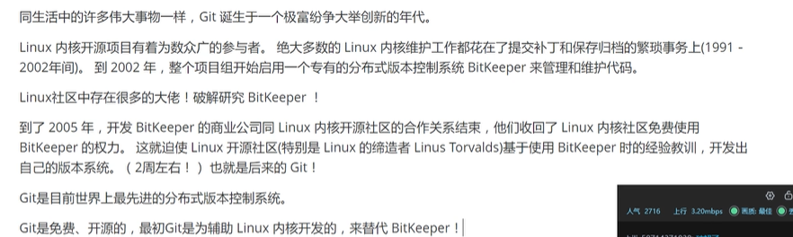

### GIT环境配置

https://git-scm.com/

镜像站！

https://npm.taobao.org/mirrors/git-for-windows/

### Git

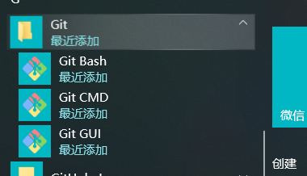

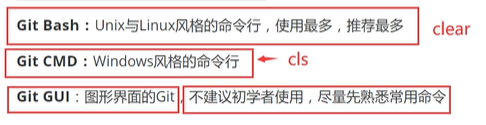

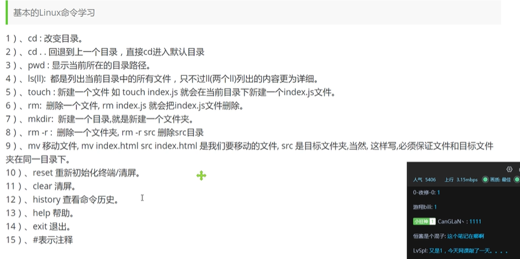

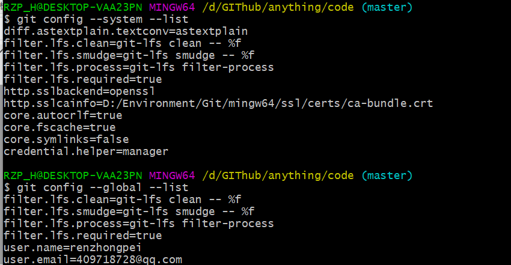

#### 所有配置文件都保存在本地

##### 1. D:\Environment\Git\etc\gitconfig 

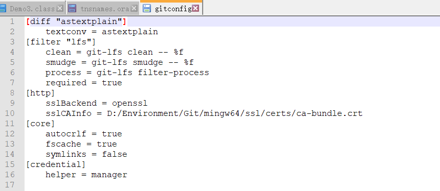

##### 2.用户配置 C:\Users\RZP_H\.gitconfig

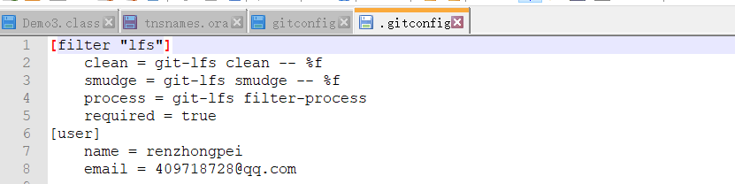

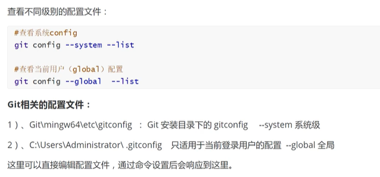

### GIT基本理论(核心)

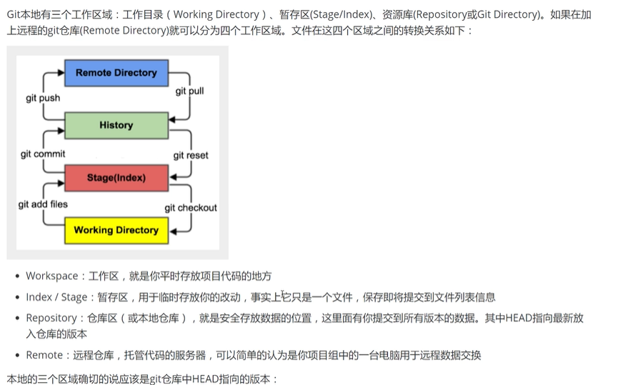

工作目录、暂存区、资源库、远程仓库

工作区：平时存放项目代码的地方。

暂存区：用于临时存放改动，事实上只是一个文件，保存即将提交的文件列表信息。

资源区：

远程仓库：Gitee

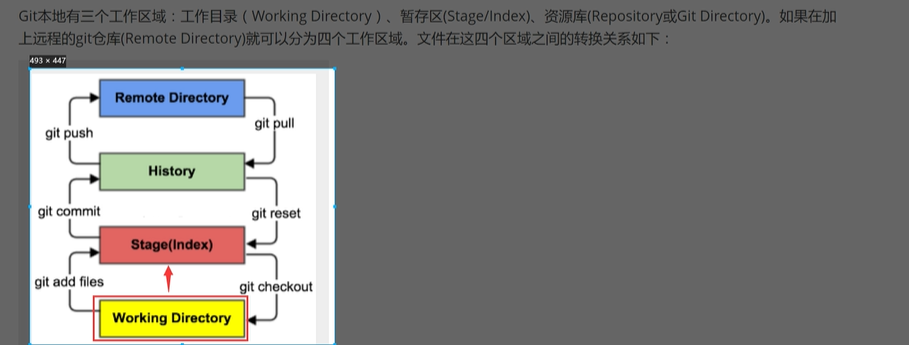

#### Gitg工作流程

1.在工作目录中添加、修改文件

2，将需要进行版本管理的文件放入暂存区域 ---git.add

### GIT项目搭建

1.本地新建仓库

git init

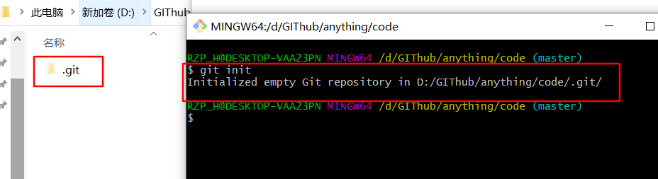

2.克隆远程仓库

git clone [url] 

git clone https://gitee.com/kuangstudy/openclass.git

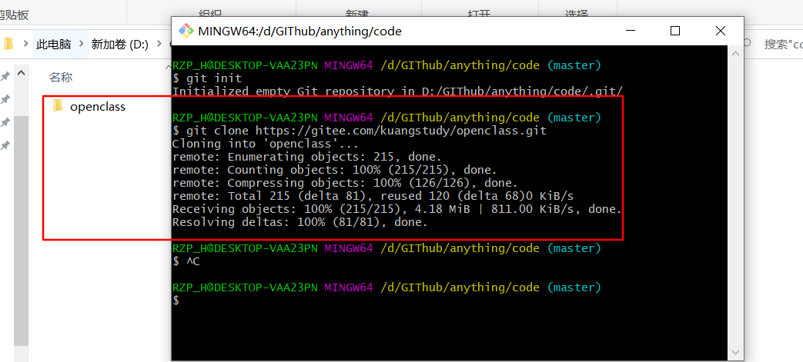

命令

1. add
2. commit
3. push
4. pull
5. checkout
6. fetch/clone

### GIT文件操作

文件的四种状态

未跟踪 untracked，此文件在文件夹中，但没有加入到git库，不参与版本控制

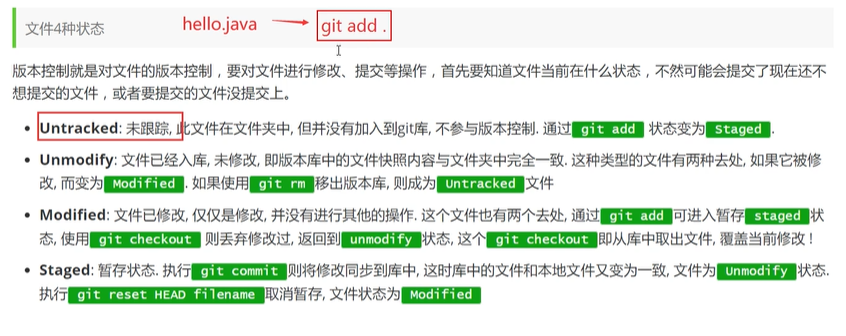

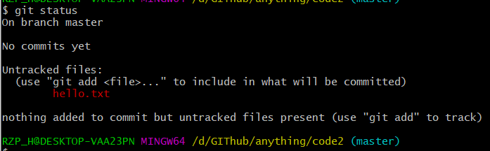

#### 忽略文件

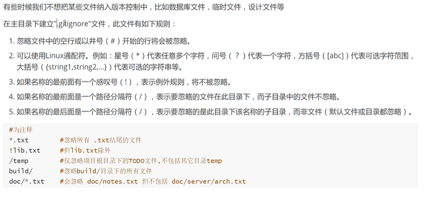

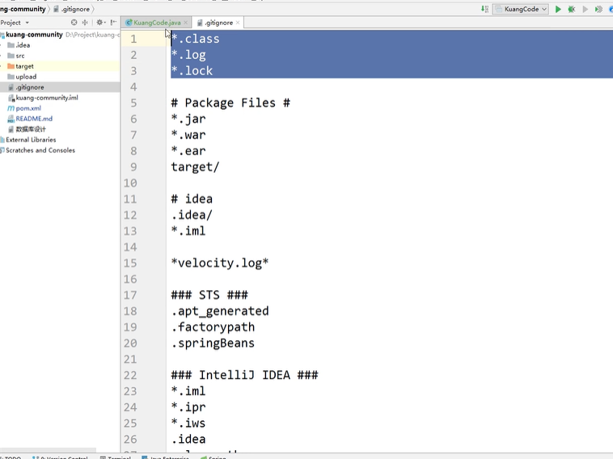

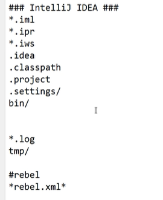

### 使用码云

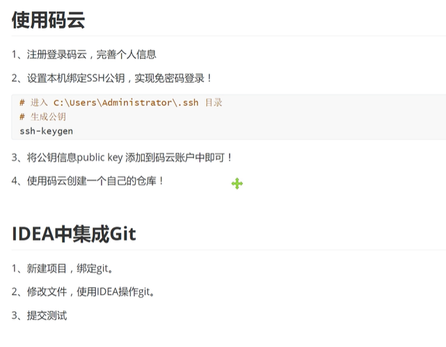

### IDEA中继承GIT

### GIT分支

